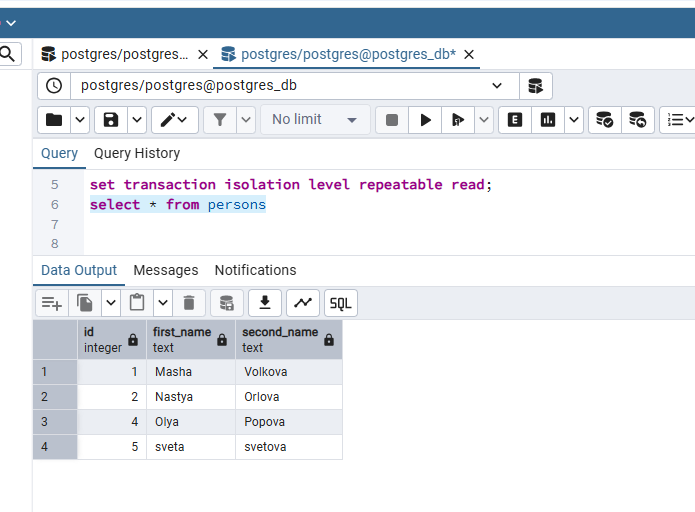

# Решение

1. запустить docker с postgres

  ```bash
  docker-compose up -d
  ```

2. запустить везде psql из под пользователя postgres

```bash
docker exec -ti homework1_db_1 bash
psql -U postgres
```

3. выключить auto commit

```bash
\set AUTOCOMMIT off
```


4. сделать

- в первой сессии новую таблицу и наполнить ее данными

```sql
drop table if exists persons;
create table persons(id serial, first_name text, second_name text);
insert into persons(first_name, second_name) values('Masha', 'Volkova');
insert into persons(first_name, second_name) values('Nastya', 'Orlova');
commit;
```


- посмотреть текущий уровень изоляции:

  ```sql
  show transaction isolation level;
  ```


- начать новую транзакцию в обоих сессиях с дефолтным (не меняя) уровнем изоляции

  ```sql
  begin;
  ```


- в первой сессии добавить новую запись

  ```sql
  insert into persons(first_name, second_name) values('Olya', 'Popova');
  ```


- сделать во второй сессии

  ```sql
  select * from persons;
  ```

- видите ли вы новую запись и если да то почему?


  ```bash
  Запись не видна, потому что
  а) уровень изоляции read committed (аномалия сериализации, когда результат успешной фиксации группы транзакций оказывается несогласованным при всевозможных вариантах исполнения этих транзакций по очереди.)
  б) транзакция в 1 сессии не закомичена
  ```

- завершить первую транзакцию - commit;

  ```sql
  commit;
  ```

- сделать select from persons во второй сессии

  ```sql
  select * from persons;
  ```

- видите ли вы новую запись и если да то почему?

  ```bash
  Запись видна, потому что в 1 сессии выполнили commit
  ```


- завершите транзакцию во второй сессии

  ```sql
  end;
  ```

- начать новые но уже repeatable read транзации

  ```sql
  set transaction isolation level repeatable read;
  ```

- в первой сессии добавить новую запись

  ```sql
  insert into persons(first_name, second_name) values('sveta', 'svetova');
  ```

- сделать во второй сессии

  ```sql
  select * from persons
  ```

- видите ли вы новую запись и если да то почему?

  ```bash
  Запись не видна, потому что
  а) уровень изоляции repeatable read (неповторяющееся чтение, при которой )не поддерживается аномалия сериализации, когда результат успешной фиксации группы транзакций оказывается несогласованным при всевозможных вариантах исполнения этих транзакций по очереди.)
  б) транзакция в 1 сессии не закомичена
  ```


- завершить первую транзакцию - commit;

  ```sql
  commit;
  ```

- сделать select from persons во второй сессии

  ```sql
  select * from persons
  ```

- видите ли вы новую запись и если да то почему?

  ```bash
  Запись не видна, потому что а) уровень изоляции repeatable read + б) транзакция в 2 сессии начала чтение до коммита в 1, то есть видит снепшот данных до начала транзакции
  ```


- завершить вторую транзакцию

  ```sql
  commit;
  ```

- сделать во второй сессии

  ```sql
  select * from persons
  ```

- видите ли вы новую запись и если да то почему?

  ```bash
  Запись видна. В новой транзакции видено уже новый измененный в 1 сессии снепшот.
  ```

  

# Адрес проекта

<https://github.com/nvv2020/otus_pg>

# Решение

Решение расположено в файле answer.md.
