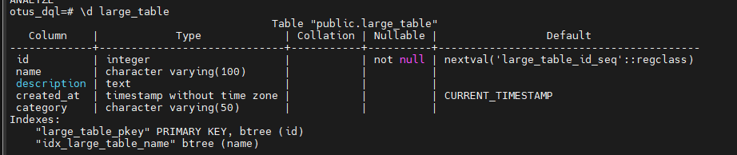
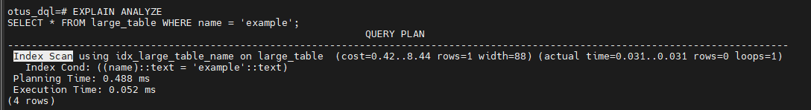
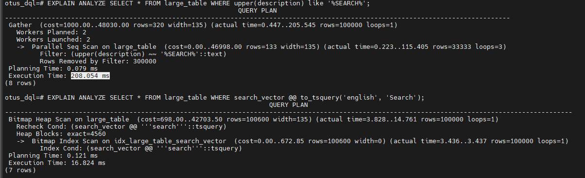
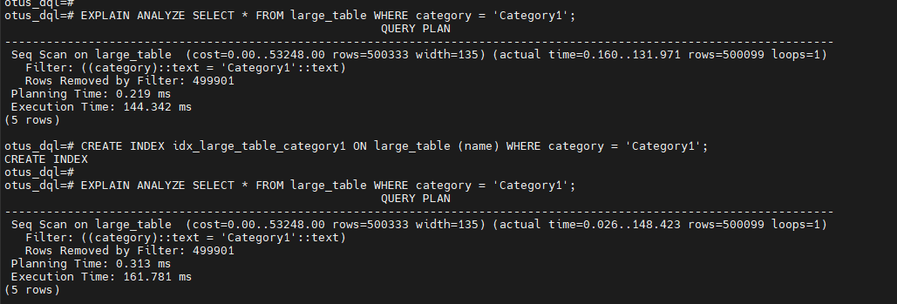
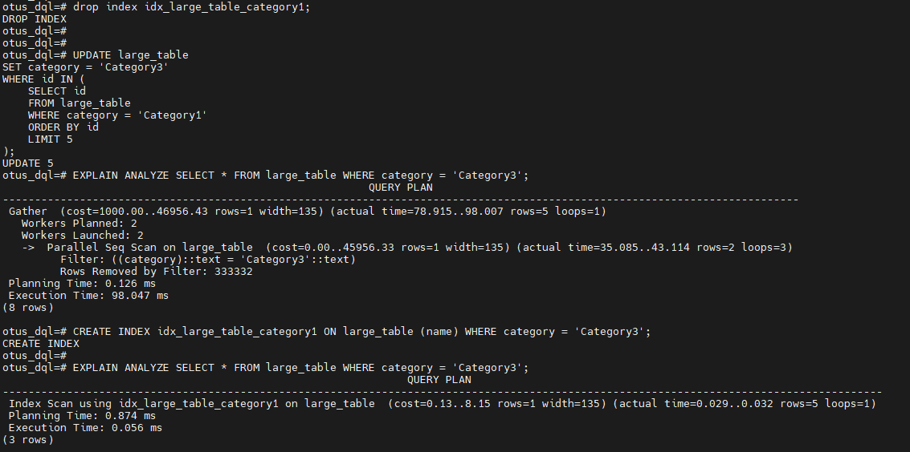
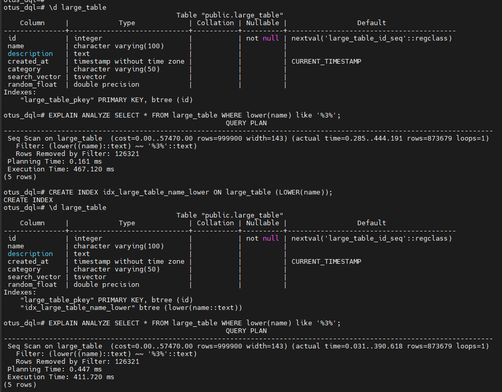
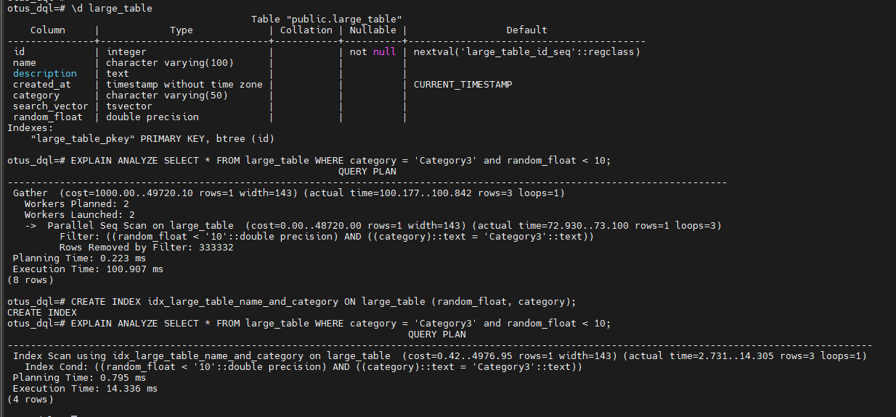

# Домашнее задание

Работа с индексами

## Цель

- знать и уметь применять основные виды индексов PostgreSQL
- строить и анализировать план выполнения запроса
- уметь оптимизировать запросы для с использованием индексов

## Описание/Пошаговая инструкция выполнения домашнего задания

- Создать индекс к какой-либо из таблиц вашей БД
- Прислать текстом результат команды explain, в которой используется данный индекс
- Реализовать индекс для полнотекстового поиска
- Реализовать индекс на часть таблицы или индекс на поле с функцией
- Создать индекс на несколько полей
- Написать комментарии к каждому из индексов
- Описать что и как делали и с какими проблемами столкнулись

```sql

-- создаем таблицу
CREATE TABLE large_table (
    id SERIAL PRIMARY KEY,
    name VARCHAR(100),
    description TEXT,
    created_at TIMESTAMP DEFAULT CURRENT_TIMESTAMP,
    category VARCHAR(50)
);

-- наполянем данными
INSERT INTO large_table (name, description, category)
SELECT
    md5(random()::text) AS name,
    md5(random()::text) AS description,
    CASE WHEN random() < 0.5 THEN 'Category1' ELSE 'Category2' END AS category
FROM generate_series(1, 1000000);

-- создаем индекс
CREATE INDEX idx_large_table_name ON large_table (name);
ANALYZE large_table;
```



```sql
-- запрос, использующий индекс
EXPLAIN ANALYZE
SELECT * FROM large_table WHERE name = 'example';
```



```sql
-- добавление индекса для полнотекстового поиска
---- подготовим данные для теста
UPDATE large_table
SET description = description || ' ' ||
    CASE
        WHEN random() < 0.33 THEN 'Search'
        WHEN random() < 0.66 THEN 'sEarch'
        ELSE 'searcH'
    END
WHERE id % 10 = 0;
UPDATE large_table
SET description = description || ' ' ||
    CASE
        WHEN random() < 0.25 THEN 'PostgreSQL'
        WHEN random() < 0.50 THEN 'pOSTGRESQL'
        WHEN random() < 0.75 THEN 'PostgresQL'
        ELSE 'POSTgreSQL'
    END
WHERE id % 100 = 0;
---- добавим индекс
ALTER TABLE large_table ADD COLUMN search_vector tsvector;
UPDATE large_table SET search_vector = to_tsvector('english', description);
CREATE INDEX idx_large_table_search_vector ON large_table USING GIN (search_vector);
--сравним использование gin индекса с тем, как я бы сделала до того, как узнала про gin..
EXPLAIN ANALYZE SELECT * FROM large_table WHERE search_vector @@ to_tsquery('english', 'Search');
EXPLAIN ANALYZE SELECT * FROM large_table WHERE upper(description) like '%SEARCH%';
-- время выполнения значительно сократилось
```



```sql
-- добавление индекса на часть таблицы (частичный индекс)
---- если кол-во возвращаемых строк будет больеш 25% смысла особого в индексе не будет
EXPLAIN ANALYZE SELECT * FROM large_table WHERE category = 'Category1';
CREATE INDEX idx_large_table_category1 ON large_table (name) WHERE category = 'Category1';
EXPLAIN ANALYZE SELECT * FROM large_table WHERE category = 'Category1';
```



```sql
-- если же кол-во строк, покрываемых индексом снизится, то план выполнения резко улучшается
UPDATE large_table
SET category = 'Category3'
WHERE id IN (
    SELECT id
    FROM large_table
    WHERE category = 'Category1'
    ORDER BY id
    LIMIT 5
);
EXPLAIN ANALYZE SELECT * FROM large_table WHERE category = 'Category3';
CREATE INDEX idx_large_table_category1 ON large_table (name) WHERE category = 'Category3';
EXPLAIN ANALYZE SELECT * FROM large_table WHERE category = 'Category3';
```



```sql
-- добавление  индекса на поле с функцией
EXPLAIN ANALYZE SELECT * FROM large_table WHERE lower(name) like '%3%';
CREATE INDEX idx_large_table_name_lower ON large_table (LOWER(name));
EXPLAIN ANALYZE SELECT * FROM large_table WHERE lower(name) like '%3%';
--  в моем примере получилось, что смысла в индексе нет
```



```sql
-- добавление индекса на несколько полей (комбинированный индекс)
EXPLAIN ANALYZE SELECT * FROM large_table WHERE category = 'Category3' and random_float < 10;
CREATE INDEX idx_large_table_name_and_category ON large_table (random_float, category);
-- для того, чтобы составные индексы были действенными, в запросах необходимо осуществлять выборку по всем полям индексов
```

