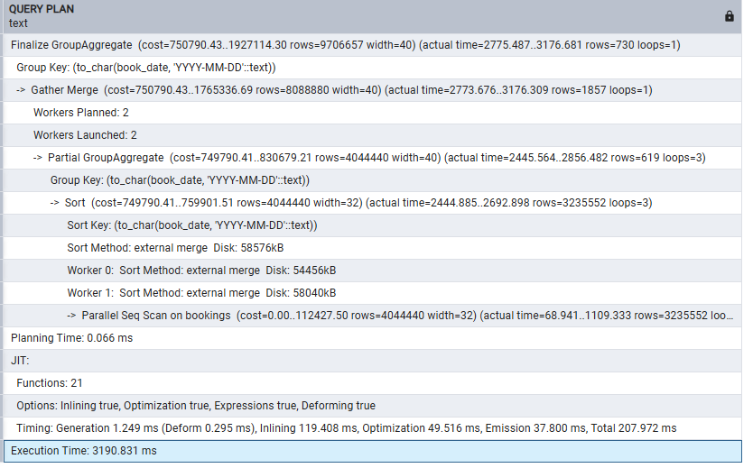
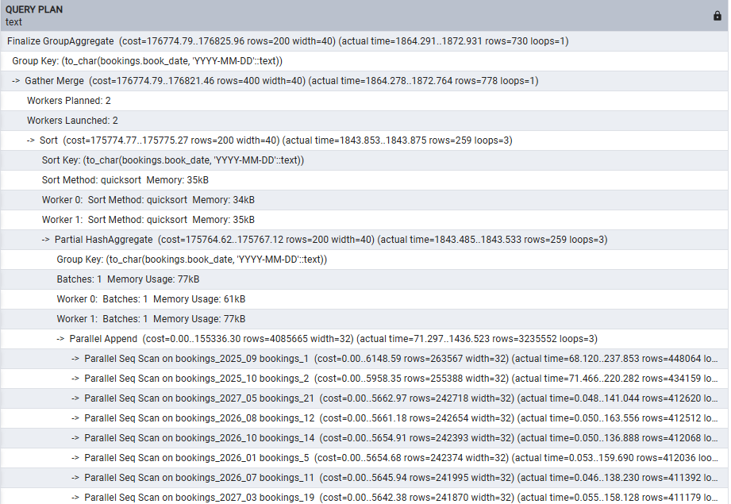
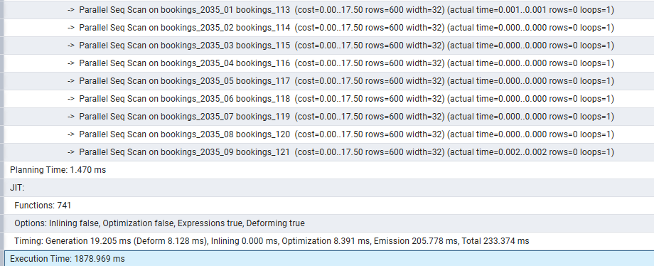
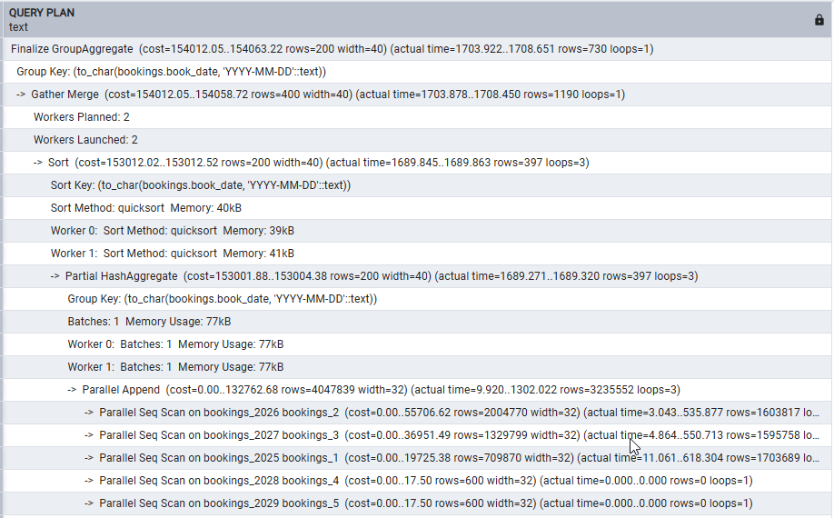
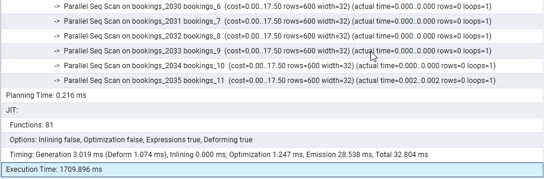

# Домашнее задание

Секционирование таблицы

## Цель

- научиться выполнять секционирование таблиц в PostgreSQL;
- повысить производительность запросов и упростив управление данными;

## Описание/Пошаговая инструкция выполнения домашнего задания

На основе готовой базы данных (<https://postgrespro.ru/education/demodb>) примените один из методов секционирования в зависимости от структуры данных.

```bash
wget https://edu.postgrespro.ru/demo-20250901-2y.sql.gz
gunzip -c demo-20250901-2y.sql.gz | psql -U postgres
```

## Партиционирование bookings

```sql
-- посмотрим, по сколько примерно записей пишется в таблицу ежемесячно (12-13 тысяч строк)
SELECT
    TO_CHAR(book_date, 'YYYY-MM-DD') AS month,
    COUNT(*) AS bookings_count
FROM bookings.bookings
GROUP BY TO_CHAR(book_date, 'YYYY-MM-DD')
ORDER BY month;

-- проведем секционирование по диапазону дат бронирований:

-- вариант 1: создадим партиции по месяцам
DO $$
DECLARE
    curr_date date := '2025-09-01';
    end_date date := '2035-09-01';
    p_name text;
    p_start date;
    p_end date;
BEGIN
    CREATE TABLE IF NOT EXISTS nvv_month.bookings (
        book_ref character(6) NOT NULL,
        book_date timestamp with time zone NOT NULL,
        total_amount numeric(10,2) NOT NULL,
        CONSTRAINT bookings_pkey PRIMARY KEY (book_ref, book_date)
    ) PARTITION BY RANGE (book_date);
    WHILE curr_date <= end_date LOOP
        p_start := curr_date;
        p_end := curr_date + INTERVAL '1 month';
        p_name := 'bookings_' || TO_CHAR(curr_date, 'YYYY_MM');
        IF NOT EXISTS (
            SELECT 1 FROM information_schema.tables
            WHERE table_name = p_name
            AND table_schema = 'nvv_month'
        ) THEN
            EXECUTE format(
                'CREATE TABLE nvv_month.%I PARTITION OF nvv_month.bookings
                 FOR VALUES FROM (%L) TO (%L)',
                p_name,
                p_start,
                p_end
            );

            RAISE NOTICE 'Создана партиция: %', p_name;
        END IF;
        curr_date := curr_date + INTERVAL '1 month';
    END LOOP;
END $$;

-- вариант 2: создадим партиции по годам
DO $$
DECLARE
    current_year integer := 2025;
    end_year integer := 2035;
    partition_name text;
    partition_start date;
    partition_end date;
BEGIN
    CREATE TABLE IF NOT EXISTS nvv_year.bookings (
        book_ref character(6) NOT NULL,
        book_date timestamp with time zone NOT NULL,
        total_amount numeric(10,2) NOT NULL,
        CONSTRAINT bookings_pkey PRIMARY KEY (book_ref, book_date)
    ) PARTITION BY RANGE (book_date);
    WHILE current_year <= end_year LOOP
        partition_start := TO_DATE(current_year::text || '-01-01', 'YYYY-MM-DD');
        partition_end := TO_DATE((current_year + 1)::text || '-01-01', 'YYYY-MM-DD');
        partition_name := 'bookings_' || current_year::text;
        IF NOT EXISTS (
            SELECT 1 FROM information_schema.tables
            WHERE table_name = partition_name
            AND table_schema = 'nvv_year'
        ) THEN
            EXECUTE format(
                'CREATE TABLE nvv_year.%I PARTITION OF nvv_year.bookings
                 FOR VALUES FROM (%L) TO (%L)',
                partition_name,
                partition_start,
                partition_end
            );
            RAISE NOTICE 'Создана партиция: %', partition_name;
        ELSE
            RAISE NOTICE 'Партиция % уже существует', partition_name;
        END IF;
        current_year := current_year + 1;
    END LOOP;
END $$;

-- добавим партицию по умолчанию
CREATE TABLE nvv_year.bookings_other PARTITION OF nvv_year.bookings DEFAULT;
CREATE TABLE nvv_month.bookings_other PARTITION OF nvv_month.bookings DEFAULT;

--вставим данные в обе схемы из исходной
insert into nvv_year.bookings overriding system value select * from bookings.bookings;
insert into nvv_month.bookings overriding system value select * from bookings.bookings;

-- проверим, что распределение данных прошло корректно, заодно проведя анализ
explain analyze
SELECT
    TO_CHAR(book_date, 'YYYY-MM-DD') AS month,
    COUNT(*) AS bookings_count
FROM bookings.bookings
GROUP BY TO_CHAR(book_date, 'YYYY-MM-DD')
ORDER BY month;
-- Execution Time: 3190.831 ms

explain analyze
SELECT
    TO_CHAR(book_date, 'YYYY-MM-DD') AS month,
    COUNT(*) AS bookings_count
FROM nvv_month.bookings
GROUP BY TO_CHAR(book_date, 'YYYY-MM-DD')
ORDER BY month;
-- Execution Time: 1878.969 ms

explain analyze
SELECT
    TO_CHAR(book_date, 'YYYY-MM-DD') AS month,
    COUNT(*) AS bookings_count
FROM nvv_year.bookings
GROUP BY TO_CHAR(book_date, 'YYYY-MM-DD')
ORDER BY month;
-- Execution Time: 1709.896 ms
```




...



...


Попробуем запросы по диапазону дат:

```sql
-- диапазон входит в один месяц
explain analyze
SELECT *
FROM bookings.bookings
where book_date between '2025-10-01' and '2025-10-10'
-- Execution Time: 160.668 ms

explain analyze
SELECT *
FROM nvv_month.bookings
where book_date between '2025-10-01' and '2025-10-10'
-- Execution Time: 30.636 ms

explain analyze
SELECT *
FROM nvv_year.bookings
where book_date between '2025-10-01' and '2025-10-10'
-- Execution Time: 50.241 ms

-- диапазон захватывает 3 месяца
explain analyze
SELECT *
FROM bookings.bookings
where book_date between '2025-10-01' and '2025-12-10'
-- Execution Time: 455.417 ms

explain analyze
SELECT *
FROM nvv_month.bookings
where book_date between '2025-10-01' and '2025-12-10'
-- Execution Time: 176.532 ms

explain analyze
SELECT *
FROM nvv_year.bookings
where book_date between '2025-10-01' and '2025-12-10'
-- Execution Time: 133.765 ms
```

Попробуем dml insert: вставим по 100 строк в каждую из таблиц с произволным разбросом дат

```sql
explain analyze
INSERT INTO bookings.bookings (book_ref, book_date, total_amount)
SELECT
    UPPER(SUBSTRING(MD5(RANDOM()::text) FROM 1 FOR 6)) as book_ref,
    TIMESTAMP '2025-09-01 00:00:00' +
        (RANDOM() * EXTRACT(EPOCH FROM (TIMESTAMP '2035-01-31 23:59:59' - TIMESTAMP '2025-09-01 00:00:00')) || ' seconds')::interval as book_date,
    ROUND((RANDOM() * 49000 + 1000)::numeric, 2) as total_amount
FROM generate_series(1, 100);
-- Execution Time: 2.539 ms

explain analyze
INSERT INTO nvv_month.bookings (book_ref, book_date, total_amount)
SELECT
    UPPER(SUBSTRING(MD5(RANDOM()::text) FROM 1 FOR 6)) as book_ref,
    TIMESTAMP '2025-09-01 00:00:00' +
        (RANDOM() * EXTRACT(EPOCH FROM (TIMESTAMP '2035-01-31 23:59:59' - TIMESTAMP '2025-09-01 00:00:00')) || ' seconds')::interval as book_date,
    ROUND((RANDOM() * 49000 + 1000)::numeric, 2) as total_amount
FROM generate_series(1, 100);
-- Execution Time: 5.418 ms

explain analyze
INSERT INTO nvv_year.bookings (book_ref, book_date, total_amount)
SELECT
    UPPER(SUBSTRING(MD5(RANDOM()::text) FROM 1 FOR 6)) as book_ref,
    TIMESTAMP '2025-09-01 00:00:00' +
        (RANDOM() * EXTRACT(EPOCH FROM (TIMESTAMP '2035-01-31 23:59:59' - TIMESTAMP '2025-09-01 00:00:00')) || ' seconds')::interval as book_date,
    ROUND((RANDOM() * 49000 + 1000)::numeric, 2) as total_amount
FROM generate_series(1, 100);
-- Execution Time: 1.722 ms
```

Попробуем dml delete: удалим строки, где дата равна первому числу любого месяца

```sql
-- зальем предварительно данные
create table nvv_month.tickets  as SELECT * from bookings.tickets;
create table nvv_month.segments as SELECT * from bookings.segments s;
create table nvv_month.boarding_passes as SELECT * from bookings.boarding_passes s;
create table nvv_year.tickets  as SELECT * from bookings.tickets;
create table nvv_year.segments as SELECT * from bookings.segments s;
create table nvv_year.boarding_passes as SELECT * from bookings.boarding_passes s;

-- выполним удаление в схеме bookings
EXPLAIN ANALYZE
WITH
bookings_to_delete AS (
    SELECT book_ref
    FROM bookings.bookings
    WHERE DATE(book_date) = DATE(DATE_TRUNC('month', book_date))
),
tickets_to_delete AS (
    SELECT ticket_no
    FROM bookings.tickets
    WHERE book_ref IN (SELECT book_ref FROM bookings_to_delete)
),
segments_to_delete AS (
    SELECT s.ticket_no, s.flight_id
    FROM bookings.segments s
    WHERE s.ticket_no IN (SELECT ticket_no FROM tickets_to_delete)
),
deleted_boarding_passes AS (
    DELETE FROM bookings.boarding_passes bp
    USING segments_to_delete sd
    WHERE bp.ticket_no = sd.ticket_no AND bp.flight_id = sd.flight_id
    RETURNING bp.ticket_no
),
deleted_segments AS (
    DELETE FROM bookings.segments s
    WHERE s.ticket_no IN (SELECT ticket_no FROM tickets_to_delete)
    RETURNING s.ticket_no
),
deleted_tickets AS (
    DELETE FROM bookings.tickets t
    WHERE t.book_ref IN (SELECT book_ref FROM bookings_to_delete)
    RETURNING t.book_ref
),
deleted_bookings AS (
    DELETE FROM bookings.bookings b
    WHERE b.book_ref IN (SELECT book_ref FROM bookings_to_delete)
    RETURNING b.book_ref
)
SELECT
    (SELECT COUNT(*) FROM deleted_boarding_passes) as boarding_passes_deleted,
    (SELECT COUNT(*) FROM deleted_segments) as segments_deleted,
    (SELECT COUNT(*) FROM deleted_tickets) as tickets_deleted,
    (SELECT COUNT(*) FROM deleted_bookings) as bookings_deleted;
-- Execution Time: 124019.611 ms 02:06

-- выполним удаление в схеме nvv_month
EXPLAIN ANALYZE
WITH
bookings_to_delete AS (
    SELECT book_ref
    FROM nvv_month.bookings
    WHERE DATE(book_date) = DATE(DATE_TRUNC('month', book_date))
),
tickets_to_delete AS (
    SELECT ticket_no
    FROM nvv_month.tickets
    WHERE book_ref IN (SELECT book_ref FROM bookings_to_delete)
),
segments_to_delete AS (
    SELECT s.ticket_no, s.flight_id
    FROM nvv_month.segments s
    WHERE s.ticket_no IN (SELECT ticket_no FROM tickets_to_delete)
),
deleted_boarding_passes AS (
    DELETE FROM nvv_month.boarding_passes bp
    USING segments_to_delete sd
    WHERE bp.ticket_no = sd.ticket_no AND bp.flight_id = sd.flight_id
    RETURNING bp.ticket_no
),
deleted_segments AS (
    DELETE FROM nvv_month.segments s
    WHERE s.ticket_no IN (SELECT ticket_no FROM tickets_to_delete)
    RETURNING s.ticket_no
),
deleted_tickets AS (
    DELETE FROM nvv_month.tickets t
    WHERE t.book_ref IN (SELECT book_ref FROM bookings_to_delete)
    RETURNING t.book_ref
),
deleted_bookings AS (
    DELETE FROM nvv_month.bookings b
    WHERE b.book_ref IN (SELECT book_ref FROM bookings_to_delete)
    RETURNING b.book_ref
)
SELECT
    (SELECT COUNT(*) FROM deleted_boarding_passes) as boarding_passes_deleted,
    (SELECT COUNT(*) FROM deleted_segments) as segments_deleted,
    (SELECT COUNT(*) FROM deleted_tickets) as tickets_deleted,
    (SELECT COUNT(*) FROM deleted_bookings) as bookings_deleted;
-- Execution Time: 98119.299 ms 01:40

-- выполним удаление в схеме nvv_year
EXPLAIN ANALYZE
WITH
bookings_to_delete AS (
    SELECT book_ref
    FROM nvv_year.bookings
    WHERE DATE(book_date) = DATE(DATE_TRUNC('month', book_date))
),
tickets_to_delete AS (
    SELECT ticket_no
    FROM nvv_year.tickets
    WHERE book_ref IN (SELECT book_ref FROM bookings_to_delete)
),
segments_to_delete AS (
    SELECT s.ticket_no, s.flight_id
    FROM nvv_year.segments s
    WHERE s.ticket_no IN (SELECT ticket_no FROM tickets_to_delete)
),
deleted_boarding_passes AS (
    DELETE FROM nvv_year.boarding_passes bp
    USING segments_to_delete sd
    WHERE bp.ticket_no = sd.ticket_no AND bp.flight_id = sd.flight_id
    RETURNING bp.ticket_no
),
deleted_segments AS (
    DELETE FROM nvv_year.segments s
    WHERE s.ticket_no IN (SELECT ticket_no FROM tickets_to_delete)
    RETURNING s.ticket_no
),
deleted_tickets AS (
    DELETE FROM nvv_year.tickets t
    WHERE t.book_ref IN (SELECT book_ref FROM bookings_to_delete)
    RETURNING t.book_ref
),
deleted_bookings AS (
    DELETE FROM nvv_year.bookings b
    WHERE b.book_ref IN (SELECT book_ref FROM bookings_to_delete)
    RETURNING b.book_ref
)
SELECT
    (SELECT COUNT(*) FROM deleted_boarding_passes) as boarding_passes_deleted,
    (SELECT COUNT(*) FROM deleted_segments) as segments_deleted,
    (SELECT COUNT(*) FROM deleted_tickets) as tickets_deleted,
    (SELECT COUNT(*) FROM deleted_bookings) as bookings_deleted;
-- Execution Time: 30845.429 ms 00:31

```

### Вывод

С учетом:

- не очень большого объема ежемесячных записей;
- не значительного улучшения времени в случае партиционировании по месяцам и запроса select в пределах месяца;
- значительного уеличения производительности в случае dml delete;
правильнее кажется партиционировать таблицу bookings по годам.
Особенно учитывая, что с достижением большого количества партиций postgres начинает работать все менее оптимально.
