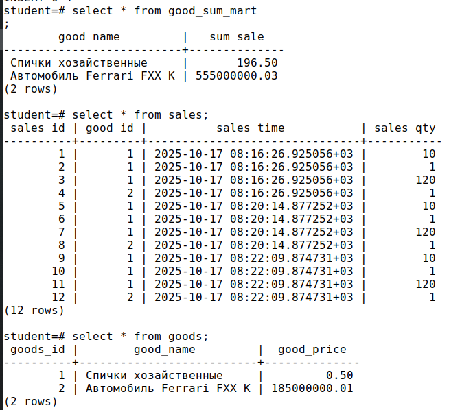
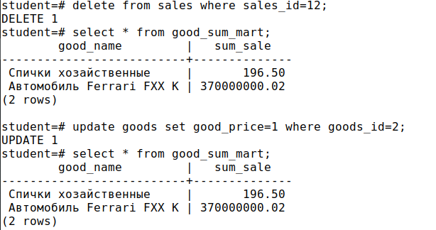
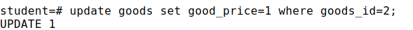
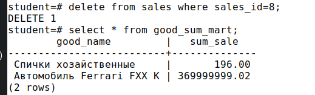

# Домашнее задание

Триггеры, поддержка заполнения витрин

## Цель

Создать триггер для поддержки витрины в актуальном состоянии.

## Пошаговая инструкция выполнения домашнего задания

Скрипт и развернутое описание задачи – в ЛК (файл hw_triggers.sql) или по ссылке: https://disk.yandex.ru/d/l70AvknAepIJXQ
В БД создана структура, описывающая товары (таблица goods) и продажи (таблица sales).
Есть запрос для генерации отчета – сумма продаж по каждому товару.
БД была денормализована, создана таблица (витрина), структура которой повторяет структуру отчета.
Создать триггер на таблице продаж, для поддержки данных в витрине в актуальном состоянии (вычисляющий при каждой продаже сумму и записывающий её в витрину)
Подсказка: не забыть, что кроме INSERT есть еще UPDATE и DELETE
Задание со звездочкой*
Чем такая схема (витрина+триггер) предпочтительнее отчета, создаваемого "по требованию" (кроме производительности)?
Подсказка: В реальной жизни возможны изменения цен.

```sql
DROP SCHEMA IF EXISTS pract_functions CASCADE;
CREATE SCHEMA pract_functions;
SET search_path = pract_functions, publ;
-- товары:
CREATE TABLE goods
(
    goods_id    integer PRIMARY KEY,
    good_name   varchar(63) NOT NULL,
    good_price  numeric(12, 2) NOT NULL CHECK (good_price > 0.0)
);
INSERT INTO goods (goods_id, good_name, good_price)
VALUES (1, 'Спички хозайственные', .50),(2, 'Автомобиль Ferrari FXX K', 185000000.01);
-- Продажи
CREATE TABLE sales
(
    sales_id    integer GENERATED ALWAYS AS IDENTITY PRIMARY KEY,
    good_id     integer REFERENCES goods (goods_id),
    sales_time  timestamp with time zone DEFAULT now(),
    sales_qty   integer CHECK (sales_qty > 0)
);
INSERT INTO sales (good_id, sales_qty) VALUES (1, 10), (1, 1), (1, 120), (2, 1);
-- отчет:
SELECT G.good_name, sum(G.good_price * S.sales_qty)
FROM goods G
INNER JOIN sales S ON S.good_id = G.goods_id
GROUP BY G.good_name;
-- с увеличением объёма данных отчет стал создаваться медленно
-- Принято решение денормализовать БД, создать таблицу
CREATE TABLE good_sum_mart(good_name varchar(63) NOT NULL,sum_sale numeric(16, 2) NOT NULL);
```

## Решение

```sql

-- пересоздадим таблицу витрины, создав первичный ключ
DROP TABLE IF EXISTS good_sum_mart;
CREATE TABLE good_sum_mart
(
    good_name   varchar(63) PRIMARY KEY,  -- Первичный ключ для ON CONFLICT
    sum_sale    numeric(16, 2) NOT NULL
);

-- Функция для триггера
CREATE OR REPLACE FUNCTION update_good_sum_mart()
RETURNS TRIGGER AS $$
DECLARE
    old_price numeric(12,2);
    new_price numeric(12,2);
    old_good_name varchar(63);
    new_good_name varchar(63);
BEGIN
    -- Обработка DELETE и UPDATE (старые данные)
    IF (TG_OP = 'DELETE' OR TG_OP = 'UPDATE') THEN
        SELECT good_price, good_name INTO old_price, old_good_name
        FROM goods WHERE goods_id = OLD.good_id;

        UPDATE good_sum_mart
        SET sum_sale = sum_sale - (old_price * OLD.sales_qty)
        WHERE good_name = old_good_name;

        -- Удаляем запись если сумма стала 0 или меньше
        DELETE FROM good_sum_mart
        WHERE good_name = old_good_name
        AND sum_sale <= 0;
    END IF;

    -- Обработка INSERT и UPDATE (новые данные)
    IF (TG_OP = 'INSERT' OR TG_OP = 'UPDATE') THEN
        SELECT good_price, good_name INTO new_price, new_good_name
        FROM goods WHERE goods_id = NEW.good_id;

        INSERT INTO good_sum_mart (good_name, sum_sale)
        VALUES (new_good_name, new_price * NEW.sales_qty)
        ON CONFLICT (good_name)
        DO UPDATE SET
            sum_sale = good_sum_mart.sum_sale + EXCLUDED.sum_sale;
    END IF;

    RETURN COALESCE(NEW, OLD);
END;
$$ LANGUAGE plpgsql;

-- Создаем триггер
CREATE OR REPLACE TRIGGER sales_good_sum_mart_trigger
    AFTER INSERT OR UPDATE OR DELETE ON sales
    FOR EACH ROW
    EXECUTE FUNCTION update_good_sum_mart();

-- Инициализируем витрину начальными данными
INSERT INTO good_sum_mart (good_name, sum_sale)
SELECT G.good_name, sum(G.good_price * S.sales_qty)
FROM goods G
INNER JOIN sales S ON S.good_id = G.goods_id
GROUP BY G.good_name
ON CONFLICT (good_name)
DO UPDATE SET sum_sale = EXCLUDED.sum_sale;

-- проверяем работу триггера:
-- вставляем данные
INSERT INTO sales (good_id, sales_qty) VALUES (1, 10), (1, 1), (1, 120), (2, 1);
-- проверяем в витрине данных
select * from good_sum_martж
```

### Преимущества схемы "витрина + триггер" (кроме производительности)

Таблица goods не имеет возможности отследить историчность цен: если мы меняем цену, то забываем предыдущее значение. Вероятно, должно быть допущение, что спички по 0.5 должны иметь id, отличный от спичек по 0.6. Но это не указано явно ..
Поэтому, если мы будем каждый раз запрашивать select-ом стоимость продаж, каждый раз мы рискуем получать разные значения в поле Сумма_продаж.
При этом в случае, например, возврата, мы вообще получим витрину с ложными данными, в которой мы можем терять/получать денег больше, чем в реальности..Но, опять же вероятно, удаление продаж запрещено..

То есть внчаале имеем цены, продажи и витрину:



Удаляем продажу



Меняем цену авто и снова удалем проаджу (возврат товара):



