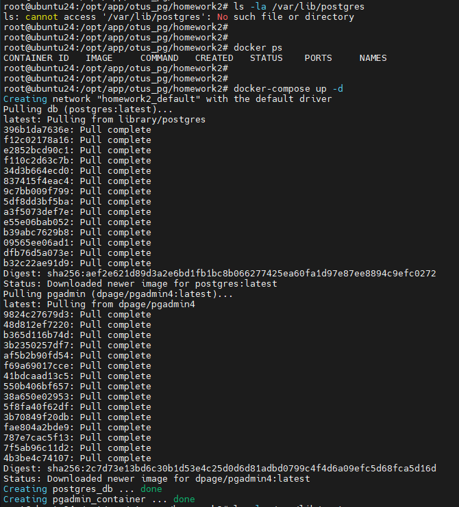
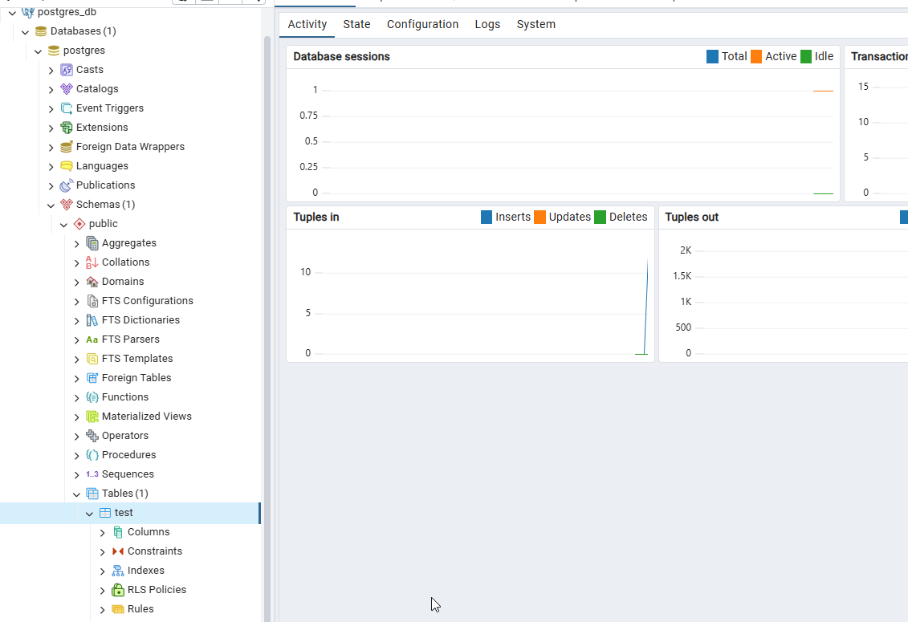
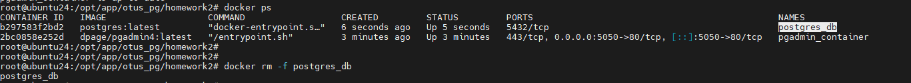
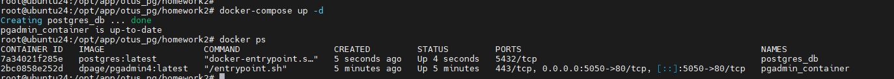
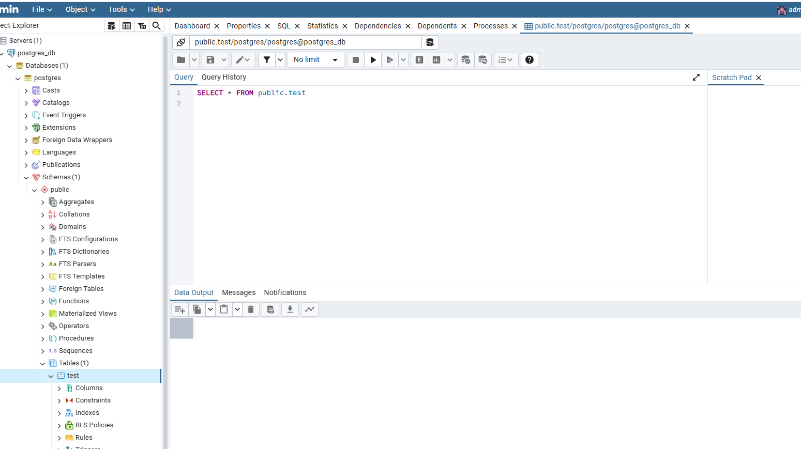

# Решение

1. поднимаем контейнер с postgresql и pgadmin (клиент)

  ```bash
  docker-compose up -d
  ```


2. создаем новую табличку в клиенте



3. удаляем контейнер с postgresql



4. создаем новый контейнер с тем же volume



5. проверяем, что табличка на месте




# Адрес проекта

<https://github.com/nvv2020/otus_pg>

# Решение

Решение расположено в файле answer.md.