# Решение

Установка и настройка PostgteSQL

1. создайте виртуальную машину c Ubuntu 20.04/22.04 LTS в ЯО/Virtual Box/докере
2. поставьте на нее PostgreSQL 17 через sudo apt


```bash
sudo apt install -y postgresql-common
sudo /usr/share/postgresql-common/pgdg/apt.postgresql.org.sh
# /etc/postgresql-common/createcluster.conf
sudo apt install postgresql-17
systemctl status postgresql
```
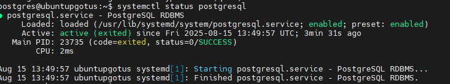

3. проверьте что кластер запущен через sudo -u postgres pg_lsclusters

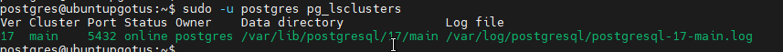

4. зайдите из под пользователя postgres в psql и сделайте произвольную таблицу с произвольным содержимым
postgres=# create table test(c1 text);
postgres=# insert into test values('1');
\q

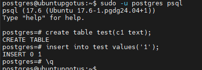

5. остановите postgres например через sudo -u postgres pg_ctlcluster 15 main stop

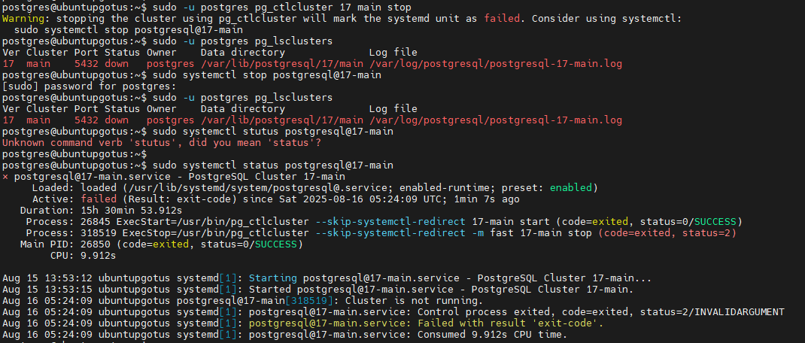

5. создайте новый диск к ВМ размером 10GB

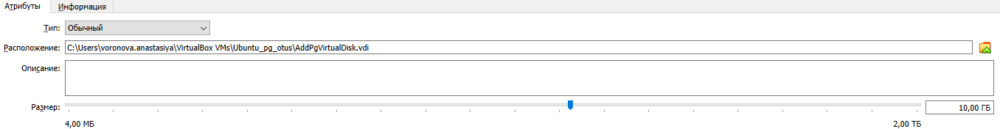

5. добавьте свеже-созданный диск к виртуальной машине - надо зайти в режим ее редактирования и дальше выбрать пункт attach existing disk

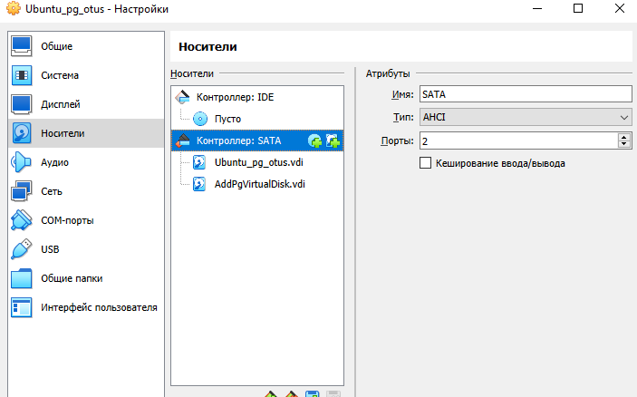

6. проинициализируйте диск согласно инструкции и подмонтировать файловую систему, только не забывайте менять имя диска на актуальное, в вашем случае это скорее всего будет /dev/sdb - https://www.digitalocean.com/community/tutorials/how-to-partition-and-format-storage-devices-in-linux

```bash
sudo apt install parted
sudo parted -l | grep Error
lsblk
sudo parted /dev/sdb mklabel gpt
sudo parted -a opt /dev/sdb mkpart primary ext4 0% 100%
lsblk --fs
sudo mkfs.ext4 -L datapartition /dev/sdb
lsblk --fs
sudo mkdir -p /mnt/data
sudo mount -o defaults /dev/sdb /mnt/data
sudo nano /etc/fstab
sudo mount -a
df -h
sudo chown -R postgres:postgres /mnt/data
sudo shutdown -h now
```

7. перезагрузите инстанс и убедитесь, что диск остается примонтированным (если не так смотрим в сторону fstab).
сделайте пользователя postgres владельцем /mnt/data - chown -R postgres:postgres /mnt/data/.

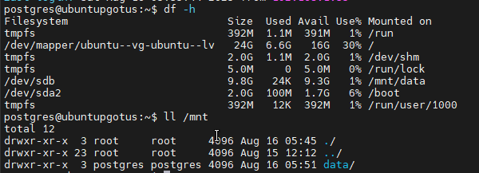

8. перенесите содержимое /var/lib/postgres/15 в /mnt/data - mv /var/lib/postgresql/15 /mnt/data

```bash
mv /var/lib/postgresql/17 /mnt/data/
```
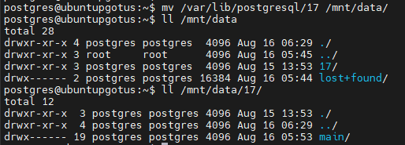

9. попытайтесь запустить кластер - sudo -u postgres pg_ctlcluster 15 main start
напишите получилось или нет и почему


10. задание: найти конфигурационный параметр в файлах раположенных в /etc/postgresql/15/main который надо поменять и поменяйте его
напишите что и почему поменяли
попытайтесь запустить кластер - sudo -u postgres pg_ctlcluster 15 main start
напишите получилось или нет и почему

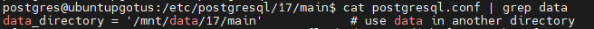

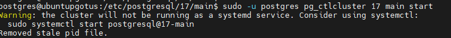

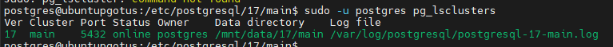

11. зайдите через через psql и проверьте содержимое ранее созданной таблицы

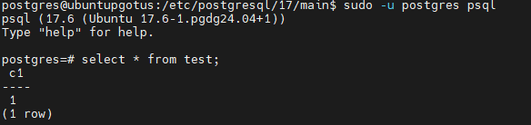

12. задание со звездочкой *: не удаляя существующий инстанс ВМ сделайте новый, поставьте на его PostgreSQL, удалите файлы с данными из /var/lib/postgres, перемонтируйте внешний диск который сделали ранее от первой виртуальной машины ко второй и запустите PostgreSQL на второй машине так чтобы он работал с данными на внешнем диске, расскажите как вы это сделали и что в итоге получилось.

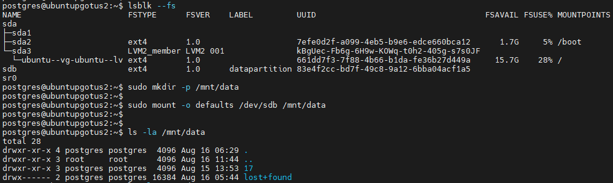

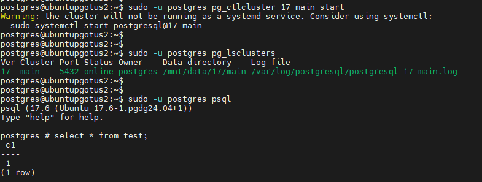

# Адрес проекта

<https://github.com/nvv2020/otus_pg>

# Решение

Решение расположено в файле answer.md.