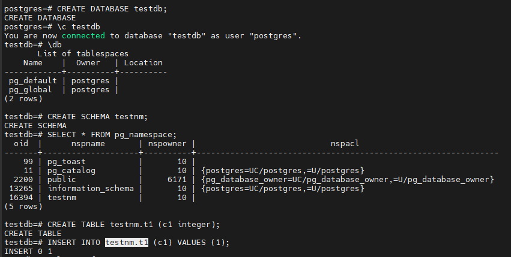
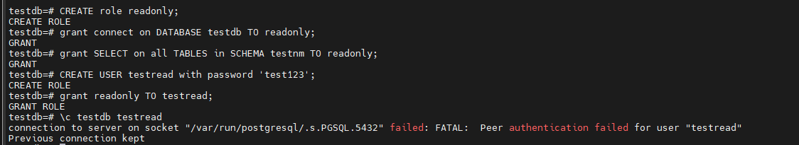
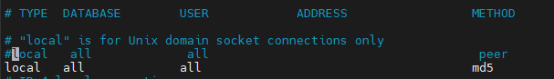
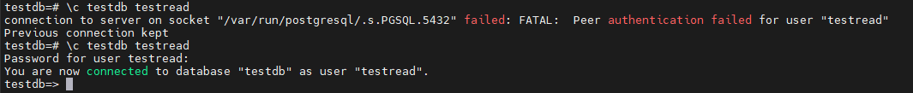
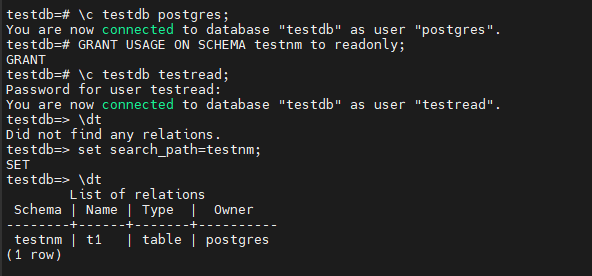
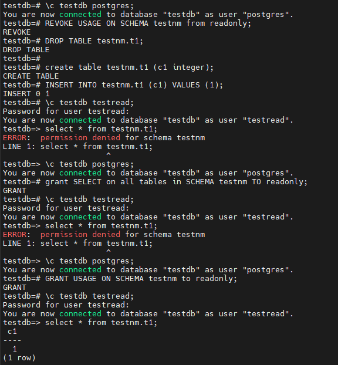
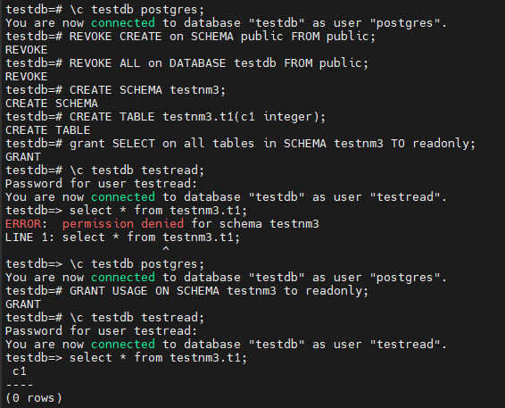

# Домашнее задание

Работа с базами данных, пользователями и правами

## Цель

- создание новой базы данных, схемы и таблицы
- создание роли для чтения данных из созданной схемы созданной базы данных
- создание роли для чтения и записи из созданной схемы созданной базы данных

## Описание/Пошаговая инструкция выполнения домашнего задания

- создайте новый кластер PostgresSQL 14
- зайдите в созданный кластер под пользователем postgres
- создайте новую базу данных testdb
- зайдите в созданную базу данных под пользователем postgres
- создайте новую схему testnm
- создайте новую таблицу t1 с одной колонкой c1 типа integer
- вставьте строку со значением c1=1

```sql
CREATE DATABASE testdb;
\c testdb
CREATE SCHEMA testnm;
CREATE TABLE testnm.t1 (c1 integer);
INSERT INTO testnm.t1 (c1) VALUES (1);
```


- создайте новую роль readonly
- дайте новой роли право на подключение к базе данных testdb
- дайте новой роли право на использование схемы testnm
- дайте новой роли право на select для всех таблиц схемы testnm
- создайте пользователя testread с паролем test123
- дайте роль readonly пользователю testread
- зайдите под пользователем testread в базу данных testdb
- сделайте select * from t1;

```sql
CREATE role readonly;
grant connect on DATABASE testdb TO readonly;
grant SELECT on all TABLES in SCHEMA testnm TO readonly;
CREATE USER testread with password 'test123';
grant readonly TO testread;
\c testdb testread
select * from t1;
```



- получилось? (могло если вы делали сами не по шпаргалке и не упустили один существенный момент про который позже). напишите что именно произошло в тексте домашнего задания
у вас есть идеи почему? ведь права то дали?

```bash
vi  /etc/postgresql/17/main/pg_hba.conf
sudo pg_ctlcluster 17 main restart
```





- посмотрите на список таблиц. подсказка в шпаргалке под пунктом 20.
а почему так получилось с таблицей (если делали сами и без шпаргалки то может у вас все нормально).

```bash
# после выдачи указзаного гранта пользователь testread увидел таблицу t1.
# никакие манипуляции с search_path, ALTER default privileges и пересозданием таблицы не помогли увидеть таблицу t1 пользователю testread
GRANT USAGE ON SCHEMA testnm to readonly;
```



- вернитесь в базу данных testdb под пользователем postgres
- удалите таблицу t1
- создайте ее заново но уже с явным указанием имени схемы testnm
- вставьте строку со значением c1=1
- зайдите под пользователем testread в базу данных testdb
- сделайте select * from testnm.t1;
- ....



Итого:
кажется, материал ДЗ или устарел или просто не корректен.



# Адрес проекта

<https://github.com/nvv2020/otus_pg>

# Решение

Решение расположено в файле answer.md.