# Домашнее задание

Нагрузочное тестирование и тюнинг PostgreSQL

## Цель

- сделать нагрузочное тестирование PostgreSQL
- настроить параметры PostgreSQL для достижения максимальной производительности

## Описание/Пошаговая инструкция выполнения домашнего задания

- развернуть виртуальную машину любым удобным способом
- поставить на неё PostgreSQL 15 любым способом
- настроить кластер PostgreSQL 15 на максимальную производительность не обращая внимание на возможные проблемы с надежностью в случае аварийной перезагрузки виртуальной машины
- нагрузить кластер через утилиту через утилиту pgbench (https://postgrespro.ru/docs/postgrespro/14/pgbench)
- написать какого значения tps удалось достичь, показать какие параметры в какие значения устанавливали и почему
- аналогично протестировать через утилиту https://github.com/Percona-Lab/sysbench-tpcc (требует установки
https://github.com/akopytov/sysbench)


```bash
create database test_db;
pgbench -i test_db -s 10
# где s - -s коэффициент_масштаба - производит умножение числа генерируемых строк на заданный коэффициент.
# Например, с ключом -s 10 в таблицу pgbench_accounts будут записаны 1 000 000 строк.
```

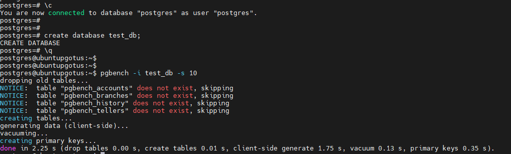

```bash
# Запускаем тест в 5 клиентов, в 2 рабочих потока, на 60 секунд с отсечкой результата каждые 5 секунд
pgbench test_db -c 5 -j 2 -P 5 -T 60
```

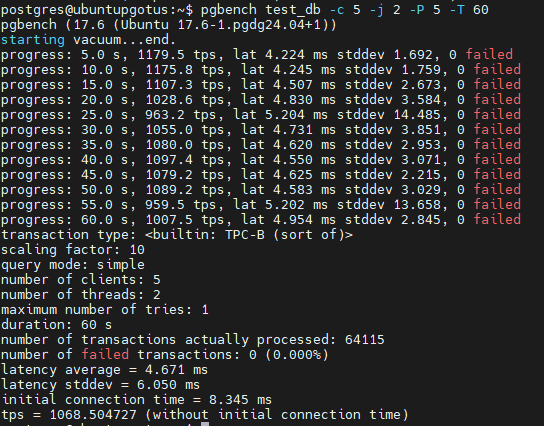

СУБД обработала 64115 транзакций со средней скоростью 1068.504727 транзакций в секунду (tps).

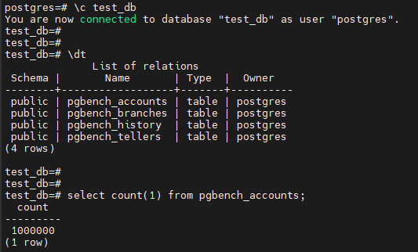

Результаты после изменения параметра fsync на off:

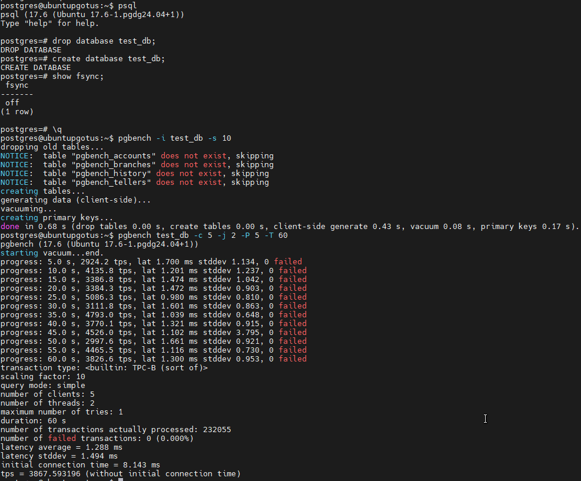

tps возрос больше, чем в 3 раза.

Результаты после изменения параметра synchronous_commit на off:

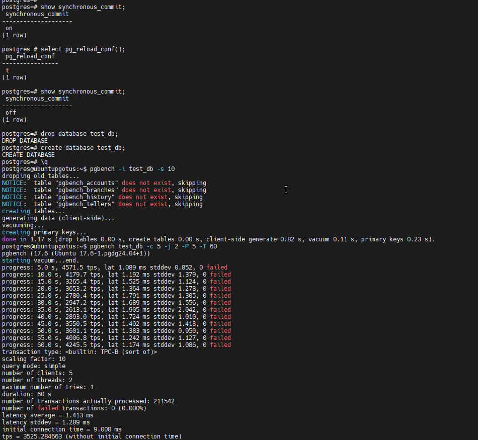

tps несколько уменьшился, что странно.

Еще запуск (без изменения параметров):

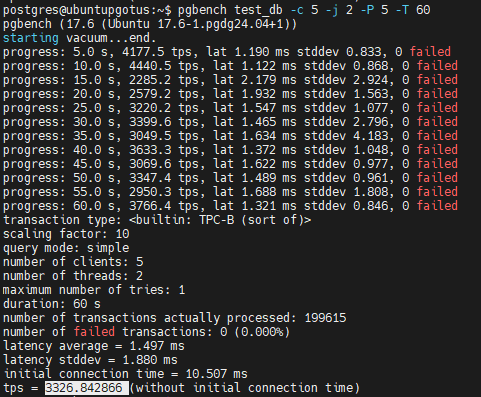

Еще небольшое снижение.

И еще запуск:

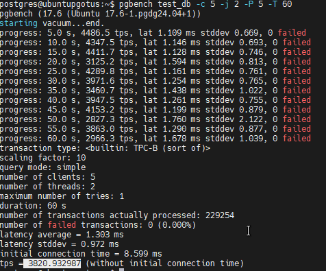

А вот при 4ом запуске уже видим небольшое увеличение tps. Интересно, закномерность (и, если да, то чем объяснить?) ил случайность:

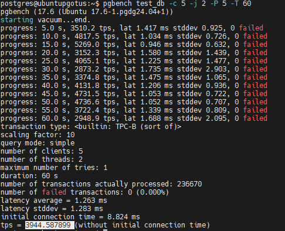

Попробуем увеличить max_connections:

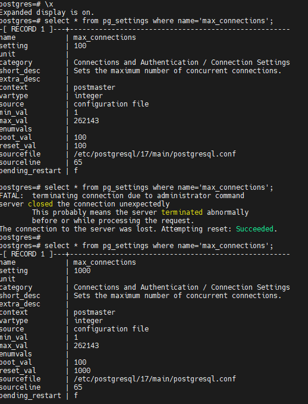

И запустить тест в 200 потоков:

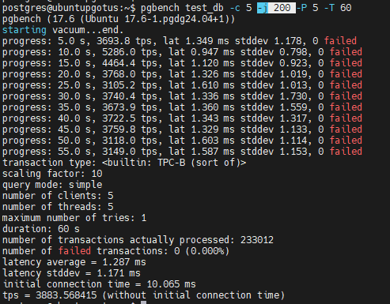

Вероятно, на нашем окружении это мало на что влияет.

Попробуем еще изменить work_mem:

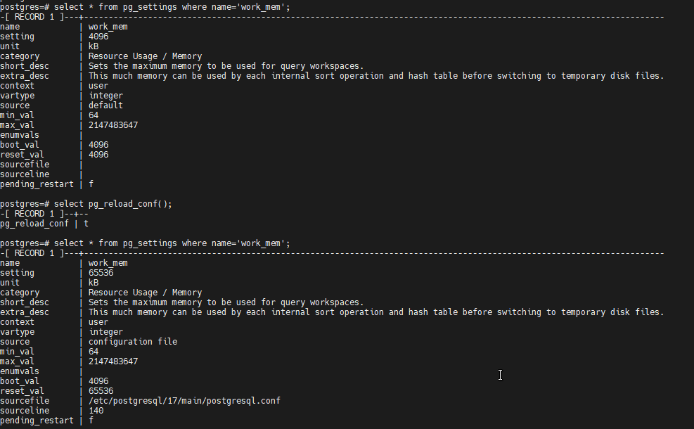

Значения увеличились до 4403.


Попробуем сравнить изменения work_mem при количестве строк 100 000 000.

При значении 64Кб получаем 3361, при 4кб - 3389:

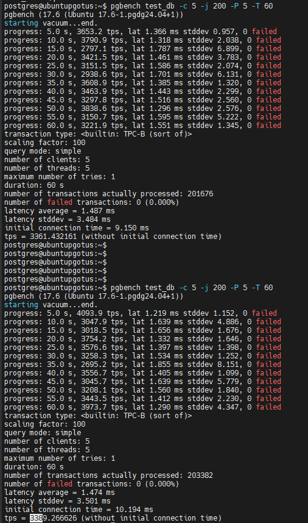

На большем объеме вм выдала, к сожалниею:

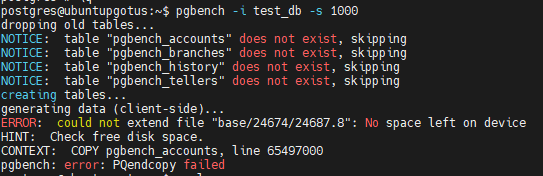

# Адрес проекта

<https://github.com/nvv2020/otus_pg>

# Решение

Решение расположено в файле answer.md.