# Домашнее задание

Настройка autovacuum с учетом особеностей производительности

## Цель

- запустить нагрузочный тест pgbench
- настроить параметры autovacuum
- проверить работу autovacuum

## Описание/Пошаговая инструкция выполнения домашнего задания

Начальное состояние:

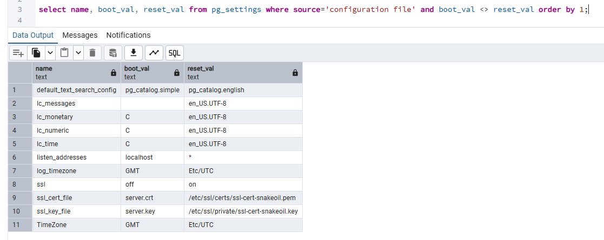

```bash
pgbench -i postgres
pgbench -c8 -P 6 -T 60 -U postgres postgres
```

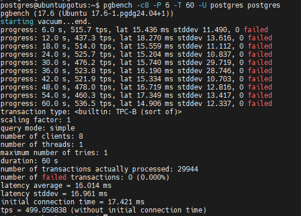

- Применить параметры настройки PostgreSQL из прикрепленного к материалам занятия файла

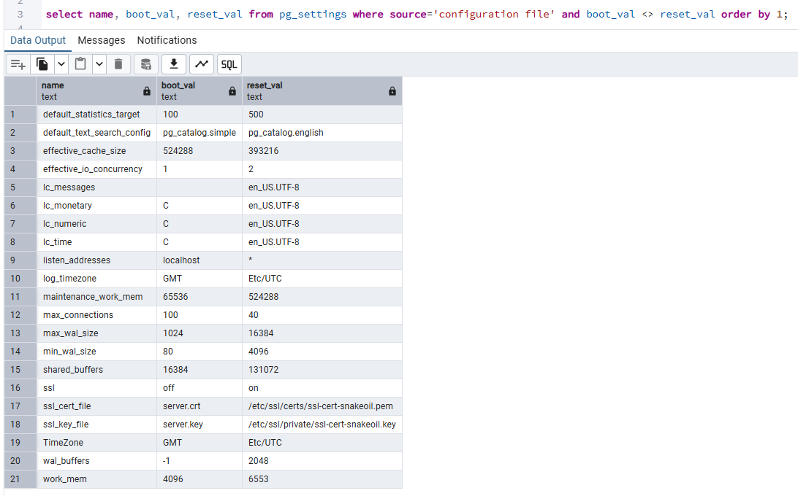

- Протестировать заново. Что изменилось и почему?

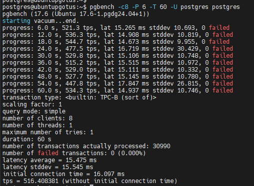

tps подрос с 499 до 516.

```bash
1. max_connections
Описание: Максимальное количество одновременных подключений к базе данных.
В нашем случае особого влияния на результат, думаю, не оказало,так как параметры запуска теста малы.

2. shared_buffers
Описание: Объём памяти, выделенной для кэширования данных.
Думаю, увеличение ускорило доступ к часто используемым данным, повысив TPS.

3. effective_cache_size
Описание: Оценка объёма памяти, доступного для кэширования данных ОС.
Влияние на TPS: завышенное значение (а у нас было изначально 4 Гб, те 100% от всей ОЗУ, может добавлять накладных расходов).
Рекомендуемое значение 50-75% от общей памяти сервера.
То есть на tps, скорее всего не повлияло, но в целом для устойчивости, это хорошо.

4. maintenance_work_mem
Описание: Память для операций обслуживания (например, VACUUM, CREATE INDEX).
Влияние на TPS: увеличение параметра ускорило операции обслуживания.
Но влиять должно в долгострочной перспективе.

5. checkpoint_completion_target
Описание: Доля времени между контрольными точками, выделенная для записи данных.
Не меняли.

6. wal_buffers
Описание: Объём памяти для хранения данных журнала (WAL).
Влияние на TPS: увеличение может уменьшить количество операций записи на диск, повысив TPS.
Слишком большое значение редко приводит к улучшению производительности.
Изначально стояло -1 sets based on shared_buffers (то есть равное shared_buffers/32 то есть 4 мб).
Если нагрузка на WAL очень высокая (например, интенсивные операции записи), можно увеличить wal_buffers до 64 МБ или больше (что мы и сделали).
В норме 16 МБ—64 МБ.
Если нагрузка на WAL минимальна, можно уменьшить wal_buffers для экономии памяти.
Мы увеличили с 4 до 16мб, что должно былопосвпособствовать увеличению tps в нашем тесте.

7. default_statistics_target
Описание: Количество собираемой статистики для оптимизации запросов.
Влияние на TPS: Увеличение улучшает качество планов запросов, что может повысить TPS.
Слишком высокое значение увеличивает накладные расходы на сбор статистики.
Обычно 100—1000.
Явно повысило наш tps после увеличения с 100 до 500.

8. random_page_cost
Описание: Оценка стоимости чтения случайных страниц с диска.
Влияние на TPS: Заниженное значение может привести к неоптимальным планам запросов.
Завышенное значение может замедлить выполнение запросов.
Рекомендация: Для SSD обычно 1.1—2.0, для HDD — 4.0.
У нас оно не менялось и осталось равным 4 (нсмотря на то, что диск ssd).

9. effective_io_concurrency
Описание: Уровень параллелизма для операций ввода-вывода.
Влияние на TPS: Увеличение может улучшить производительность на SSD и многодисковых системах.
Слишком высокое значение может перегрузить систему.
Рекомендация: Для SSD обычно 200—300, для HDD — 2—4.
Ну, мы увеличили с 1 до 2 что конечно увеличило tps, но странно, что на ssd мы так мало увеличили.

10. work_mem
Описание: Память для операций сортировки и хеширования.
Влияние на TPS: Увеличение может ускорить выполнение сложных запросов.
Слишком большое значение может привести к нехватке памяти при множестве одновременных запросов.
Рекомендация: Обычно 4 МБ—64 МБ в зависимости от размера базы данных и нагрузки.
Мы увеличили с 4 до 6 мб, что должно было увеличить tps.

11. min_wal_size
Описание: Минимальный размер файлов журнала (WAL).
Влияние на TPS: Увеличение может уменьшить количество операций записи, повысив TPS.
Слишком большое значение увеличивает объём журнала.
Рекомендация: Обычно 1 ГБ—4 ГБ.
Мы увеличили с 80mb до 4GB, что должно было увеличить tps.

12. max_wal_size
Описание: Максимальный размер файлов журнала (WAL).
Влияние на TPS: Увеличение может уменьшить частоту контрольных точек, повысив TPS.
Слишком большое значение увеличивает объём журнала и время восстановления.
Рекомендация: Обычно 4 ГБ—16 ГБ.
Мы увеличили с 1 gb до 16GB, что должно было увеличить tps.
```

- Создать таблицу с текстовым полем и заполнить случайными или сгенерированными данным в размере 1млн строк

```bash
Особенность при выполнении дз: В случае генерации 1млн строк с текстовым полем в 10 символов и 5апдейтами в 1 символ на 10 10GB вылезла ошибка:
```

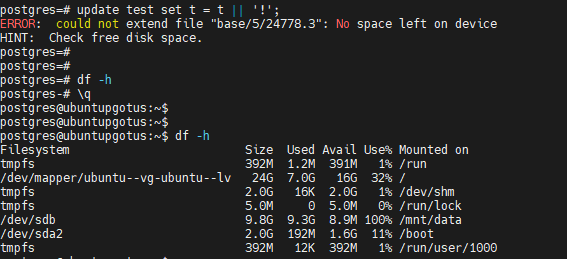

```sql
create table test (t char(1000));

CREATE OR REPLACE FUNCTION generate_random_string(length INT) RETURNS TEXT AS $$
DECLARE
    result TEXT := '';
BEGIN
    FOR i IN 1..length LOOP
        result := result || chr((random() * 26 + 97)::int);
    END LOOP;
    RETURN result;
END;
$$ LANGUAGE plpgsql;

DO $$
DECLARE
    i INT := 0;
BEGIN
    FOR i IN 1..1000000 LOOP
        INSERT INTO test (t)
        VALUES (generate_random_string(2));
    END LOOP;
END;
$$;

select * from  public.test;
select count(1) from  public.test;
```

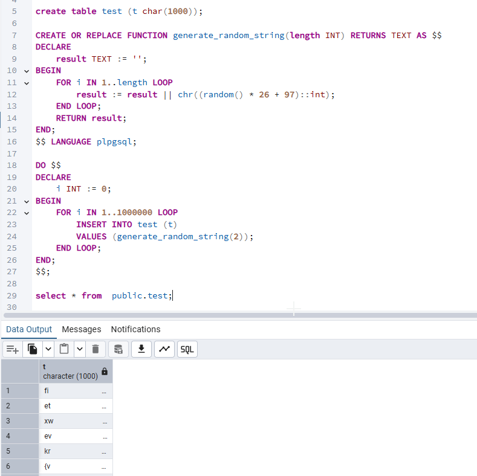

- Посмотреть размер файла с таблицей

```sql
select pg_size_pretty(pg_total_relation_size('test'));
```

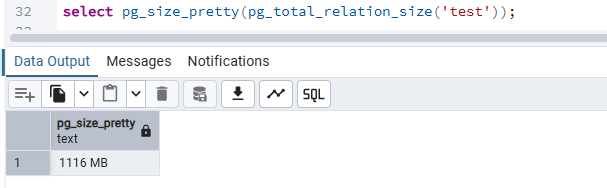

- 5 раз обновить все строчки и добавить к каждой строчке любой символ

```sql
DO $$
DECLARE
    i INT := 1;
BEGIN
    LOOP
        UPDATE test SET t = t || '+';
        RAISE NOTICE 'Итерация №% выполнена', i;
        i := i + 1;
        EXIT WHEN i > 5;
    END LOOP;
END $$;
```

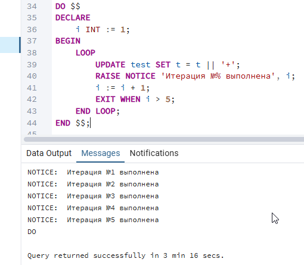

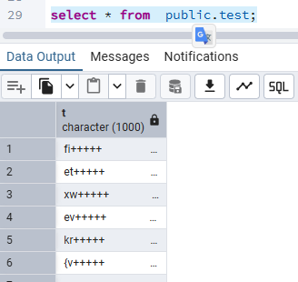

- Посмотреть количество мертвых строчек в таблице и когда последний раз приходил автовакуум

```sql
SELECT relname, n_live_tup, n_dead_tup, trunc(100*n_dead_tup/(n_live_tup+1))::float "ratio%", last_autovacuum
FROM pg_stat_user_TABLEs WHERE relname = 'test';
```

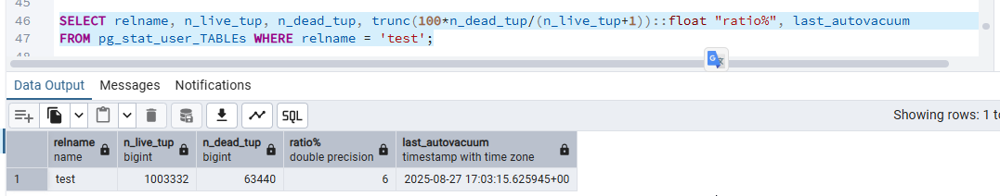

- Подождать некоторое время, проверяя, пришел ли автовакуум

```sql
-- настройки avtovacuum
SELECT name, setting, context, short_desc FROM pg_settings WHERE name like 'autovacuum%';
```

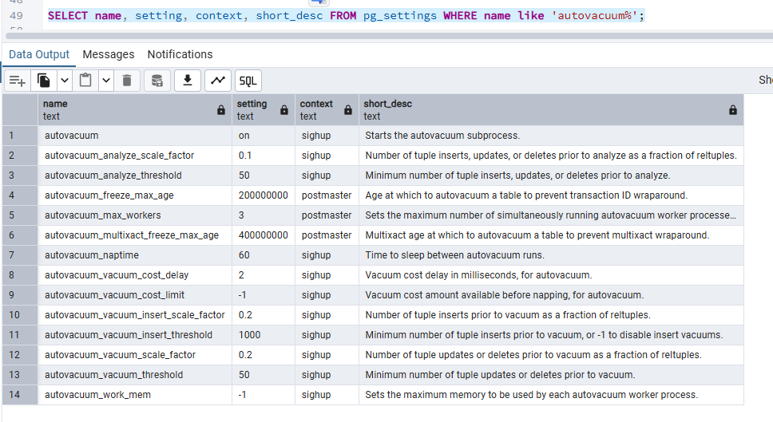

- 5 раз обновить все строчки и добавить к каждой строчке любой символ

```sql
DO $$
DECLARE
    i INT := 1;
BEGIN
    LOOP
        UPDATE test SET t = t || '!';
        RAISE NOTICE 'Итерация №% выполнена', i;
        i := i + 1;
        EXIT WHEN i > 5;
    END LOOP;
END $$;
```

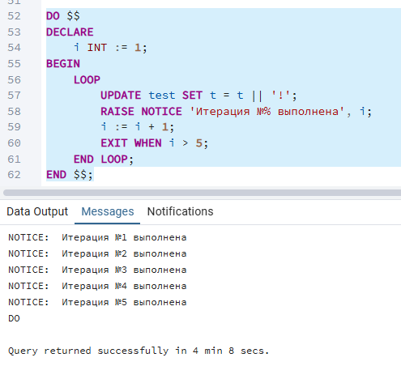


- Посмотреть размер файла с таблицей

```sql
select pg_size_pretty(pg_total_relation_size('test'));
```

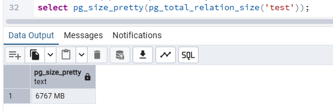

Размер не сильно поменялся, потому что были пустые строки после работы avtovacuum.

- Отключить Автовакуум на конкретной таблице

```sql
ALTER TABLE test SET (autovacuum_enabled = off);
```

- 10 раз обновить все строчки и добавить к каждой строчке любой символ

```sql
DO $$
DECLARE
    i INT := 1;
BEGIN
    LOOP
        UPDATE test SET t = t || '#';
        RAISE NOTICE 'Итерация №% выполнена', i;
        i := i + 1;
        EXIT WHEN i > 10;
    END LOOP;
END $$;
```

- Посмотреть размер файла с таблицей
- Объясните полученный результат
- Не забудьте включить автовакуум)

```sql
ALTER TABLE test SET (autovacuum_enabled = on);
```

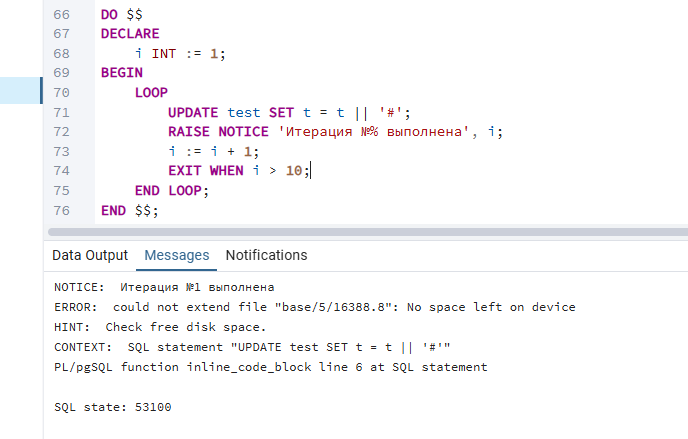

20 гб тоже не хватило.

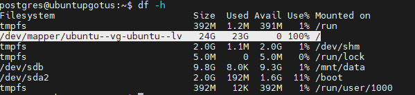

3 ий раз не стала пересоздавать кластер.
Размер файла с отключенным авктовакуумом явно увеличился, раз в 5.
Получается 6гб на 5 надо где то 40 гб для прохождения практики?

# Адрес проекта

<https://github.com/nvv2020/otus_pg>

# Решение

Решение расположено в файле answer.md.