# Домашнее задание

Работа с журналами

## Цель

- уметь работать с журналами и контрольными точками
- уметь настраивать параметры журналов

## Описание/Пошаговая инструкция выполнения домашнего задания

- Настройте выполнение контрольной точки раз в 30 секунд.

```bash
show checkpoint_timeout;
ALTER SYSTEM SET checkpoint_timeout = '30s';
SELECT pg_reload_conf();
show checkpoint_timeout;
select pg_current_wal_insert_lsn();
```

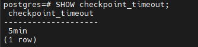

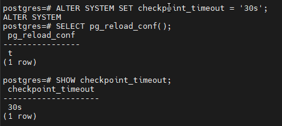

```sql
select pg_current_wal_insert_lsn(); -- 0/494398F0
select * from pg_stat_checkpointer;
```

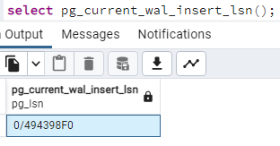

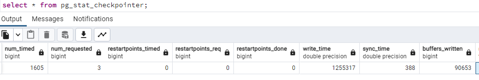


- 10 минут c помощью утилиты pgbench подавайте нагрузку.

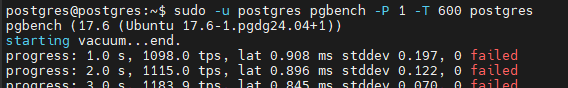

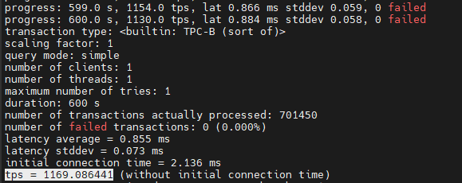

- Измерьте, какой объем журнальных файлов был сгенерирован за это время.

```sql
select pg_current_wal_insert_lsn(); --0/6B640B88
-- размер журнальных записей между ними (в байтах):
select '0/17D1EF0'::pg_lsn - '0/494398F0'::pg_lsn as bytes; -- 572551832 -- ~546 Мб
select * from pg_stat_checkpointer;
```

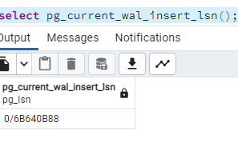

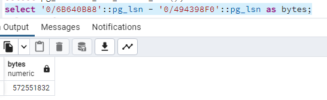

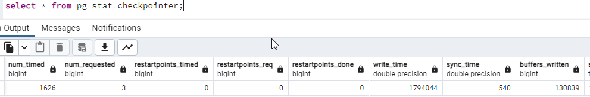

- Оцените, какой объем приходится в среднем на одну контрольную точку.

```sql
За 600 секунд должно быть 600/30 = 20 контрольных точек.
То есть 546/20 в среднем по 27,3 Мб на одну контрольную точку.
```

При этом по pg_stat_checkpointer видим:

```sql
num_timed - Количество контрольных точек, выполненных по расписанию.
1626 - 1605 = 21
num_requested -  Количество контрольных точек, выполненных по требованию.
не изменился и остался равным 3.
buffers_written - Количество буферов, записанных при выполнении контрольных точек
и точек перезапуска
132572 - 90653 = 41919
если величина буфера - 8кБ, то всего: ~ 327 Мб
что на 220 мб отличается от размера журнальных файлов.
```

- Отключим синхронный режим, выполним ретест в pgbench, сраним полученный tps с предыдущим (в синхронном режиме)

```sql
show synchronous_commit;
alter system set synchronous_commit = off;
select pg_reload_conf();
```

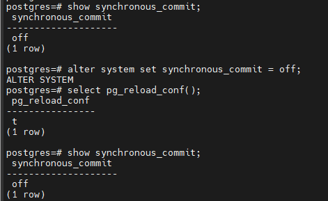

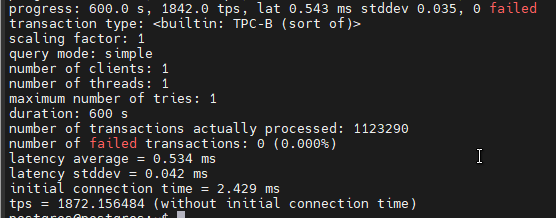

tps подрос с 1169 до 1872 транзакций.

- Создайте новый кластер с включенной контрольной суммой страниц.
Создайте таблицу. Вставьте несколько значений.

```bash
sudo pg_createcluster 17 main2 -- --data-checksums
sudo -u postgres pg_ctlcluster 17 main2 start
```

```sql
show data_checksums;
```

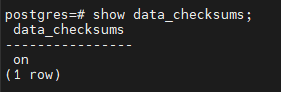

```bash
create table test_text(t text);
insert into test_text select 'строка '||s.id from generate_series(1,500) as s(id);
```

- Выключите кластер. Измените пару байт в таблице.

```sql
sudo -u postgres pg_ctlcluster 17 main2 stop
SELECT pg_relation_filepath('test_text');
vi /var/lib/postgresql/17/main2/base/5/16388
sudo -u postgres pg_ctlcluster 17 main2 start
select * from test_text;
```

- Включите кластер и сделайте выборку из таблицы. Что и почему произошло? как проигнорировать ошибку и продолжить работу?

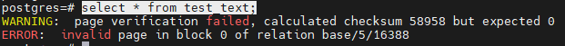

С потерей данных можно использовать временно евключение параметра SET zero_damaged_pages = on;

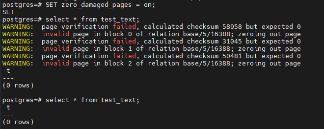

При этом данные из таблицы будут утеряны.
В дальнейшем можно попробовать восстановить их из резервной копии (например, с помощью pg_dump).