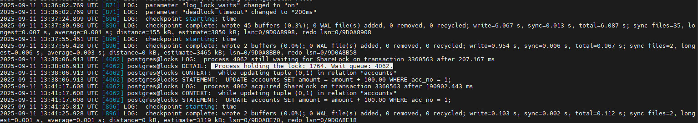
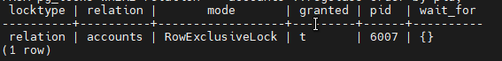
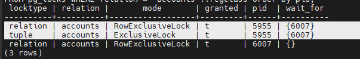
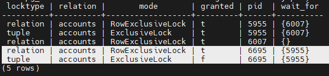
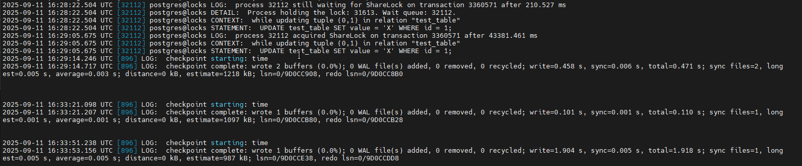
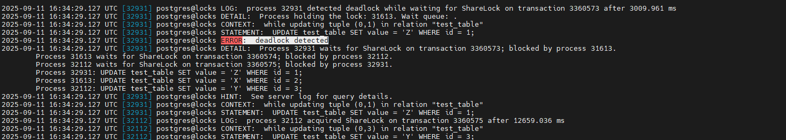
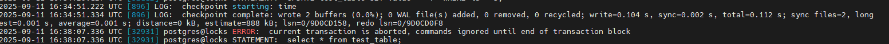
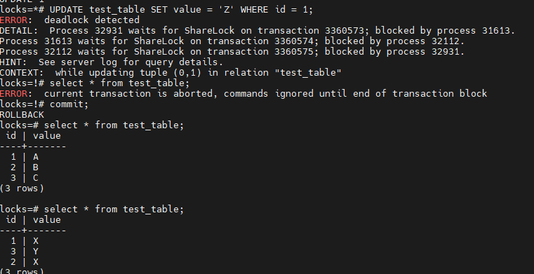

# Домашнее задание

Механизм блокировок

## Цель

понимать как работает механизм блокировок объектов и строк.

## Описание/Пошаговая инструкция выполнения домашнего задания

__Настройте сервер так, чтобы в журнал сообщений сбрасывалась информация о блокировках, удерживаемых более 200 миллисекунд.
Воспроизведите ситуацию, при которой в журнале появятся такие сообщения__

```sql
-- включим параметр log_lock_waits
ALTER SYSTEM SET log_lock_waits = on;
-- зададим deadlock_timeout равным 200 миллисекунд
ALTER SYSTEM SET deadlock_timeout = '200ms';
SELECT pg_reload_conf();
SHOW log_lock_waits;
SHOW deadlock_timeout;
```



__Смоделируйте ситуацию обновления одной и той же строки тремя командами UPDATE в разных сеансах.
Изучите возникшие блокировки в представлении pg_locks и убедитесь, что все они понятны.
Пришлите список блокировок и объясните, что значит каждая.__

```sql
-- Проверим, что нет блокировок.
SELECT locktype, relation::REGCLASS, mode, granted, pid, pg_blocking_pids(pid) AS wait_for
FROM pg_locks WHERE relation = 'accounts'::regclass order by pid;
-- откроем траназакцию в 1 сессии
BEGIN;
UPDATE accounts SET amount = amount - 100.00 WHERE acc_no = 1;
-- появилась RowExclusiveLock блокировка с pid = 6007
```



```sql
-- откроем траназакцию в 2 сессии
BEGIN;
UPDATE accounts SET amount = amount - 100.00 WHERE acc_no = 1;
-- добавилось 2 блокировки, ожидающие окончания 6007:
-- RowExclusiveLock блокировка с pid = 5955
-- tuple блокировка с pid = 5955
```



```sql
-- откроем траназакцию в 3 сессии
BEGIN;
UPDATE accounts SET amount = amount - 100.00 WHERE acc_no = 1;
-- добавилось 2 блокировки, ожидающие окончания 5955:
-- RowExclusiveLock блокировка с pid = 6695
-- tuple блокировка с pid = 6695
```



“tuple lock”  — это механизм блокировки отдельных строк таблицы для обеспечения согласованности данных при параллельных транзакциях.

__Воспроизведите взаимоблокировку трех транзакций. Можно ли разобраться в ситуации постфактум, изучая журнал сообщений?__

```sql
-- Для воспроизведения взаимоблокировки (deadlock) в PostgreSQL с участием трёх транзакций нужно создать ситуацию, где каждая транзакция блокирует ресурс, который требуется другой транзакции, образуя цикл.

-- подготовка
CREATE TABLE test_table (
    id SERIAL PRIMARY KEY,
    value TEXT
);
INSERT INTO test_table (value) VALUES ('A'), ('B'), ('C');
-- 1 сессия: Блокировка строки с id=1
BEGIN;
UPDATE test_table SET value = 'X' WHERE id = 1;
-- 2 сессия: Блокировка строки с id=2
BEGIN;
UPDATE test_table SET value = 'Y' WHERE id = 2;
-- 3 сессия: Блокировка строки с id=3
BEGIN;
UPDATE test_table SET value = 'Z' WHERE id = 3;

-- 1 сессия: Ожидание блокировки строки с id=2
UPDATE test_table SET value = 'X' WHERE id = 2;
-- 2 сессия: Ожидание блокировки строки с id=3
UPDATE test_table SET value = 'Y' WHERE id = 3;
-- 3 сессия: Ожидание блокировки строки с id=1. сгенерирован deadlock.
UPDATE test_table SET value = 'Z' WHERE id = 1;
```





```sql
-- при попытке вывести строки в 3 сессии
select * from test_table;
-- current transaction is aborted, commands ignored until end of transaction block.
-- после чего в ответ на введенную команду
commit;
-- вывел, что выполнен rollback
-- после коммитов во 2 и 1о сессиях видим, что запросы 3 сессии вообще не выполнены
```





__Могут ли две транзакции, выполняющие единственную команду UPDATE одной и той же таблицы (без where), заблокировать друг друга?__

В PostgreSQL две транзакции, выполняющие единственную команду UPDATE одной и той же таблицы без условия WHERE, в большинстве случаев не заблокируют друг друга.
Когда выполняется команда UPDATE без условия WHERE, PostgreSQL сканирует все строки таблицы и обновляет их.
PostgreSQL использует блокировки на уровне строк (row-level locks) для обеспечения согласованности данных.
Если две транзакции одновременно выполняют UPDATE всей таблицы, они будут обновлять строки последовательно, и каждая транзакция будет блокировать строки по мере их обработки.
Однако, если строки обновляются в разном порядке (например, из-за использования индексов или разного состояния таблицы), может возникнуть ситуация, когда одна транзакция блокирует строку, которая нужна другой транзакции, и наоборот. Это может привести к взаимоблокировке.